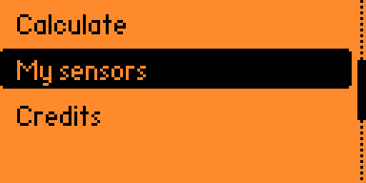
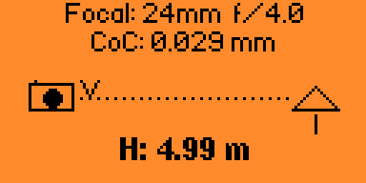

# HyperFocus Calc (Flipper Zero)

External Flipper Zero app that computes **hyperfocal distance** from focal length (mm), aperture (full-stop sequence), and each sensor’s **circle of confusion** (CoC). CoC defaults to diagonal/1500 from sensor width and height (mm); you can override CoC manually in the sensor editor.

## Screenshots

**Main menu**



**Hyperfocal calculator**



Static images are stored in [`assets/`](assets/) (`menu.png`, `hyperfocal.png`).

## Calc screen

- **Up / Down**: focal length (1 mm steps, 8–600 mm).
- **Left / Right**: aperture in full stops: 1.4, 2, 2.8, 4, 5.6, 8, 11, 16, 22.
- **Back**: main menu.

## Sensor editor

- **W / H**: adjust with Left/Right in **0.01 mm** steps (two decimal places).
- **CoC**: adjust with Left/Right in **0.001 mm** steps (three decimal places). The line shows **d/1500** (reference from current W and H) next to your CoC value.
- Changing **W** or **H** recomputes CoC from **d/1500**; you can still edit CoC afterward.

## Development

```bash
make test      # Host unit tests (domain math)
make linter    # cppcheck on domain + tests
make format    # clang-format
make prepare   # Symlink into flipperzero-firmware/applications_user
make fap       # Build .fap (requires FLIPPER_FIRMWARE_PATH)
```

Set `FLIPPER_FIRMWARE_PATH` if your firmware checkout is not `/home/endika/flipperzero-firmware`.

## License

MIT — see [LICENSE](LICENSE).
